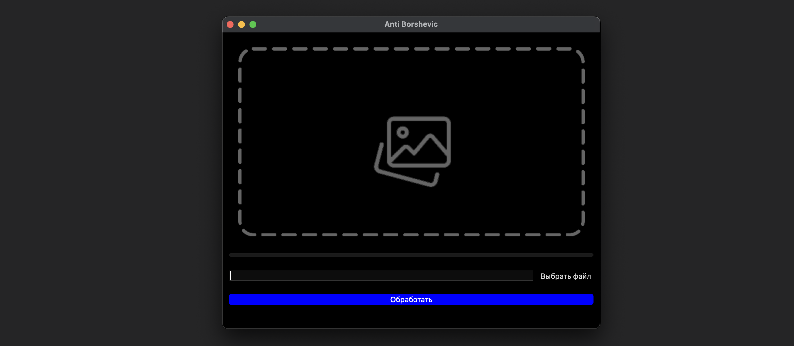
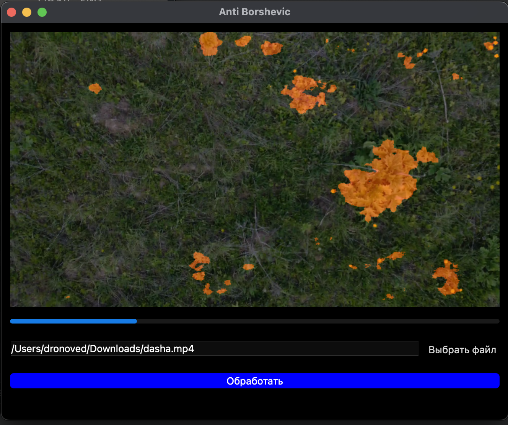

## This project made by students of Moscow Aviation Institute to fight with dangerous plants using traihed AI model

To run this app you need to have QT Creator

Or run this command in working directory:

##
    python3 main.py

The main Window of the project:

### User manual:

* Firstly "IMPORT FILE" that you want to pocessed

* Then click "Обработать" button

* You will see your video in the display with rounded defeated zones

* When the prosecces will stop you can see your rendered video in the same folder with prefix "_pocessed"